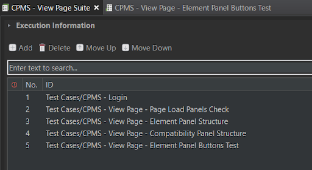
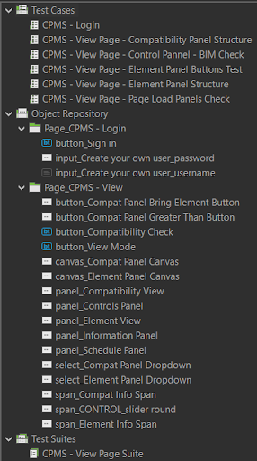
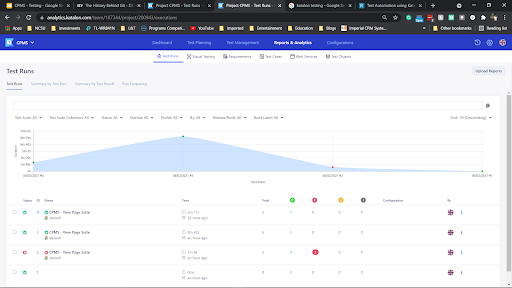
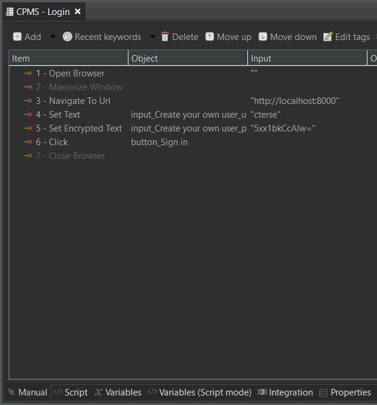

# cpms-ui-testing

Katalon tests cases to test the UI functionality of the CPMS application. Katalon Studio is an automation testing solution built on top of the open-source automation frameworks Selenium, Appium with a specialized IDE interface for web, API, mobile and desktop application testing.
Katalon Studio follows the Page Object Model pattern. GUI elements on web, mobile, and desktop apps can be captured using the recording utility and stored into the Object Repository, which is accessible and reusable across different test cases.


CPMS: http://cpms-viewer.herokuapp.com/

## How to run:
1. Install Katalon Studio.
2. Clone this repository.
3. Import cloned repo in Katalon.
4. Open test suite called CPMS Test Suite under the folder Test Suites.
5. Click on Run Test Suite button.

## Project Structure
Test cases can be structured using test suites with environment variables. Test execution can be parameterized and parallelized using profiles.

</img>

</img>

## Statistics Generation
Provided in the latest version is the native integration with Azure DevOps (ADO) which enables users to easily view statistics about test runs and passing and failing test cases in a neat UI.

</img>

## Example Test 
Example test structure - Manual Mode:

</img>

Example test structure - Script Mode:
```groovy
WebUI.openBrowser('')

not_run: WebUI.maximizeWindow()

WebUI.navigateToUrl('http://localhost:8000')

WebUI.setText(findTestObject('Object Repository/Page_CPMS - Login/input_Create your own user_username'), 'cterse')

WebUI.setEncryptedText(findTestObject('Object Repository/Page_CPMS - Login/input_Create your own user_password'), '5xx1bkCcAlw=')

WebUI.click(findTestObject('Object Repository/Page_CPMS - Login/button_Sign in'))

not_run: WebUI.closeBrowser()
```

## Tests List
|Test Case|Description|
|-----|-----|
|CPMS - Login|Tests the main login workflow.|
|CPMS - View Page - Compatibility Panel Structure|Checks the buttons, dropdown, info field and canvas of Compatibility Panel|
|CPMS - View Page - Element Panel Buttons Test|Checks working of Element Panel buttons: Compatibility View and Element View.| 
|CPMS - View Page - Element Panel Structure|Checks the buttons, dropdown, info field and canvas of Element Panel|
|CPMS - View Page - Page Load Panels Check|Checks for the presence of required panels on View page load|

